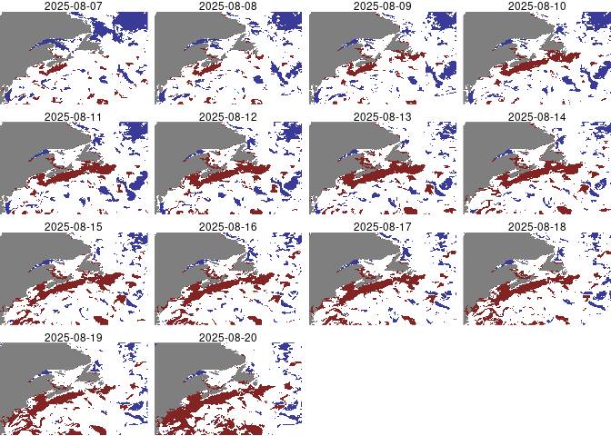
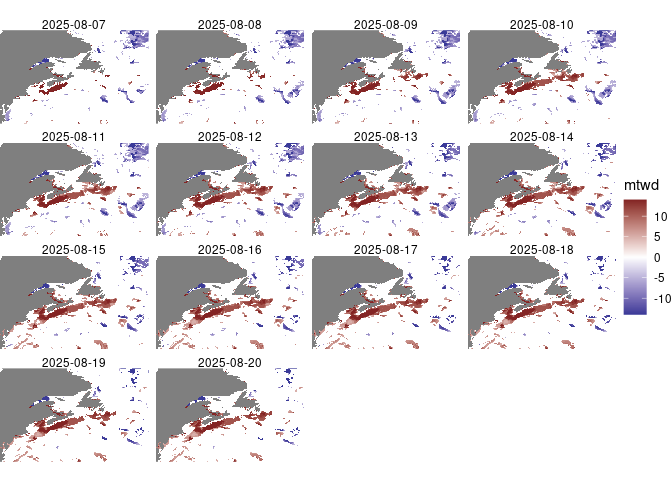

Marine Thermal Waves
================

[Hobday et al
(2016)](https://www.sciencedirect.com/science/article/abs/pii/S0079661116000057)
proposed a framework for identify marine thermal waves (mtw). Although
the authors focused on marine heat waves, the framework applies to cold
waves equally well. [Hobday et al
(2018)](https://tos.org/oceanography/article/categorizing-and-naming-marine-heatwaves)
followed up with an additional framework for categorizing the severity
of heat waves. [Huang et al
(2024)](https://agupubs.onlinelibrary.wiley.com/doi/10.1029/2024GL108369)
deployed a similar framework for study of recent conditions.

In a nutshell, conditions that identify a heat/cold wave are…

- daily values exceed the 90th percentile of values for the day of year
  measured over the last 30 years, or

- daily values fall below the 10th percentile of values for the day of
  year measured over the last 30 years, and

- the even persists for 5 or more days\*.

Here we replicate Hobday’s first framework using [Copernicus Global
Ocean Physics Reanalysis
data](https://data.marine.copernicus.eu/product/GLOBAL_MULTIYEAR_PHY_001_030/description)
and [Copernicus Global Ocean Physics Analysis and Forecast
data](https://data.marine.copernicus.eu/product/GLOBAL_ANALYSISFORECAST_PHY_001_024/description)
to develop a daily forecast (and hindcast) map for the region covering
Cape Hatteras in North Carolina to Newfoundland including the Flemish
Cap.

First we compute a raster of marine thermal wave events - that is
identifying data that exceed the 90th percentile (or fall below the 10th
percentile) of sea surface temperature for that day of year over the
last 30 years. It is important to note that these show the pixels that
are exceed or fall below the 90th (red) or 10th (blue) percentile. That
is not necessarily indicative of the presence of a heat/cold wave, so
this is just the first step.

``` r
mtw = generate_mtw()
plot_mtw(mtw)
```

<!-- -->

Next we compute the presence and duration of heat/cold waves. Here is
the heat/cold wave map. The deeper the red or blue coloring the longer
the duration of the thermal event.

``` r
mtwd = encode_mtwd(mtw)
plot_mtwd(mtwd)
```

<!-- -->
